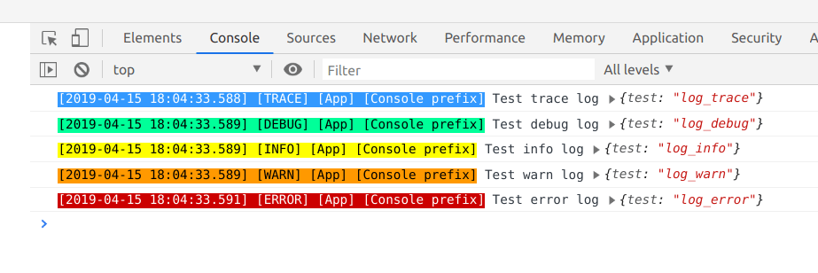

Likelog
======

[**Likelog**](https://github.com/uxname/likelog) - The Frontend Logging Framework for JavaScript
 
[**Likelog server**](https://github.com/uxname/likelogserver) - Backend part for receiving logs from Likelog 

## Size
This library is very lightweight. The minified file has 5.5 KB and can be GZip-compressed to 2 KB.

## Usage

* Install:

`yarn add likelog`

or

`npm install --save likelog`

* Usage:

```javascript
const {Likelog, ConsoleAppender, ServerAppender, Levels} = require('likelog');

const log = new Likelog({
    handleAllErrors: true,
    appenders: [
        new ConsoleAppender({
            name: "App",
            customPrefix: `Console prefix`,
            showDate: true,
            showLevels: [Levels.TRACE, Levels.DEBUG, Levels.INFO, Levels.WARN, Levels.ERROR],
        }),
        new ServerAppender({
            url: 'http://localhost:5111/log',
            name: "App",
            customPrefix: `Console prefix`,
            sendInterval: 3000,
            maxCacheSize: 1000,
            muteErrors: true,
            showLevels: [Levels.TRACE, Levels.DEBUG, Levels.INFO, Levels.WARN, Levels.ERROR],
        })
    ]
});

log.trace('Test trace log', {test: 'log_trace'});
log.debug('Test debug log', {test: 'log_debug'});
log.info('Test info log', {test: 'log_info'});
log.warn('Test warn log', {test: 'log_warn'});
log.error('Test error log', {test: 'log_error'});

log.time('testTime');
// function execution...
log.timeEnd('testTime'); // or: log.timeEnd('testTime', Levels.INFO);

```


